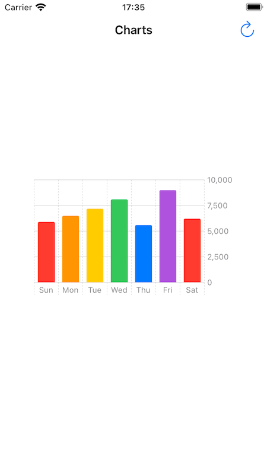

# WWSwiftUI_Charts
[](https://developer.apple.com/swift/) [](https://developer.apple.com/swift/)  [](https://developer.apple.com/swift/) [](https://developer.apple.com/swift/)

### [Introduction - 簡介](https://swiftpackageindex.com/William-Weng)
- [Transfer SwiftUI's Charts to UIKit.](https://developer.apple.com/documentation/Charts)
- [將SwiftUI的圖表功能轉給UIKit使用。](https://www.appcoda.com.tw/swiftui-line-charts/)



### [Installation with Swift Package Manager](https://medium.com/彼得潘的-swift-ios-app-開發問題解答集/使用-spm-安裝第三方套件-xcode-11-新功能-2c4ffcf85b4b)
```bash
dependencies: [
    .package(url: "https://github.com/William-Weng/WWSwiftUI_Charts.git", .upToNextMajor(from: "1.1.0"))
]
```

### 可用函式 (Function)
|函式|功能|
|-|-|
|BarMark(model:barColors:orientation:)|初始化BarMark|
|LineMark(model:unit:orientation:)|初始化LineMark|

### Example (UIKit)
```swift
import UIKit
import SwiftUI
import WWSwiftUI_MultiDatePicker
import WWSwiftUI_Charts

final class ViewController: UIViewController {
    
    @IBOutlet weak var barChartsView: UIView!
    @IBOutlet weak var lineChartsView: UIView!
    
    private var barCharts: WWSwiftUI.BarMark<ChartsData>!
    private var lineCharts: WWSwiftUI.LineMark<LineChartsData>!
    
    private var barViewModel: WWSwiftUI.BarMarkViewModel<ChartsData> = .init()
    private var lineViewModel: WWSwiftUI.LineMarkViewModel<LineChartsData> = .init()
    
    override func viewDidLoad() {
        super.viewDidLoad()
        initBarChart()
        initLineChart()
    }
    
    @IBAction func valueSetting(_ sender: UIBarButtonItem) {
        barChartSetting()
        lineChartSetting()
    }
}

private extension ViewController {
    
    func initBarChart() {
        
        let barColors: [Color] = [.red, .orange, .yellow, .green, .blue, .purple]
        
        barViewModel.data = [.init(label: "Sun", value: 5900)]
        barCharts = .init(model: barViewModel, barColors: barColors)
        barCharts.move(toParent: self, on: barChartsView)
    }
    
    func initLineChart() {
        lineCharts = .init(model: lineViewModel)
        lineViewModel.data = [.init(label: "台北", data: [.init(date: .now, value: 100)])]
        lineCharts.move(toParent: self, on: lineChartsView)
    }
    
    func barChartSetting() {
               
        let stepsData: [ChartsData] = [
            .init(label: "Sun", value: 5900),
            .init(label: "Mon", value: 6500),
            .init(label: "Tue", value: 7200),
            .init(label: "Wed", value: 8100),
            .init(label: "Thu", value: 5600),
            .init(label: "Fri", value: 9000),
            .init(label: "Sat", value: 6200),
        ]
        
        barViewModel.data = stepsData
    }
    
    func lineChartSetting() {
        
        let date1: Date = .now.addingTimeInterval(-86400 * 3)
        let date2: Date = .now.addingTimeInterval(-86400 * 2)
        let date3: Date = .now.addingTimeInterval(-86400 * 1)
        let date4: Date = .now.addingTimeInterval(-86400 * 0)
        
        let taipeiData: [LineChartsValue] = [
            .init(date: date1, value: 20),
            .init(date: date2, value: 35),
            .init(date: date3, value: 8),
            .init(date: date4, value: 25)
        ]
        
        let hkData: [LineChartsValue] = [
            .init(date: date1, value: 10),
            .init(date: date2, value: 25),
            .init(date: date3, value: 18),
            .init(date: date4, value: 35)
        ]

        lineViewModel.data = [
            .init(label: "Taipei", data: taipeiData),
            .init(label: "Hong Kong", data: hkData)
        ]
    }
}
```

### Example (SwiftUI)
```swift
import SwiftUI
import WWSwiftUI_MultiDatePicker
import WWSwiftUI_Charts

struct SwiftUIView: View {
    
    @StateObject private var viewModel = WWSwiftUI.BarMarkViewModel<ChartsData>()
    
    @State private var stepsData: [ChartsData] = [
        .init(label: "Sun", value: 5900),
        .init(label: "Mon", value: 6500),
        .init(label: "Tue", value: 7200),
        .init(label: "Wed", value: 8100),
        .init(label: "Thu", value: 5600),
        .init(label: "Fri", value: 9000),
        .init(label: "Sat", value: 6200),
    ]
    
    var body: some View {
        
        let barColors: [Color] = [.red, .orange, .yellow, .green, .blue, .purple]
        
        WWSwiftUI.BarMarkView(model: viewModel, barColors: barColors)
            .onAppear { viewModel.data = stepsData }
            .padding()
    }
}

#Preview {
    SwiftUIView()
}
```

### Example (SwiftUI)
```swift
import SwiftUI
import WWSwiftUI_MultiDatePicker
import WWSwiftUI_Charts

struct SwiftUIView2: View {
    
    @State var taipeiData: [LineChartsValue] = []
    @State var hkData: [LineChartsValue] = []
    
    @StateObject private var viewModel = WWSwiftUI.LineMarkViewModel<LineChartsData>()
    
    var body: some View {
        
        WWSwiftUI.LineMarkView<LineChartsData>(model: viewModel, orientation: .vertical).onAppear {
            
            let date1: Date = .now.addingTimeInterval(-86400 * 3)
            let date2: Date = .now.addingTimeInterval(-86400 * 2)
            let date3: Date = .now.addingTimeInterval(-86400 * 1)
            let date4: Date = .now.addingTimeInterval(-86400 * 0)
            
            taipeiData = [
                .init(date: date1, value: 20),
                .init(date: date2, value: 35),
                .init(date: date3, value: 8),
                .init(date: date4, value: 25)
            ]
            
            hkData = [
                .init(date: date1, value: 10),
                .init(date: date2, value: 25),
                .init(date: date3, value: 18),
                .init(date: date4, value: 35)
            ]

            viewModel.data = [
                .init(label: "台北", data: taipeiData),
                .init(label: "香港", data: hkData)
            ]
        }
    }
}

#Preview {
    SwiftUIView2()
}
```
